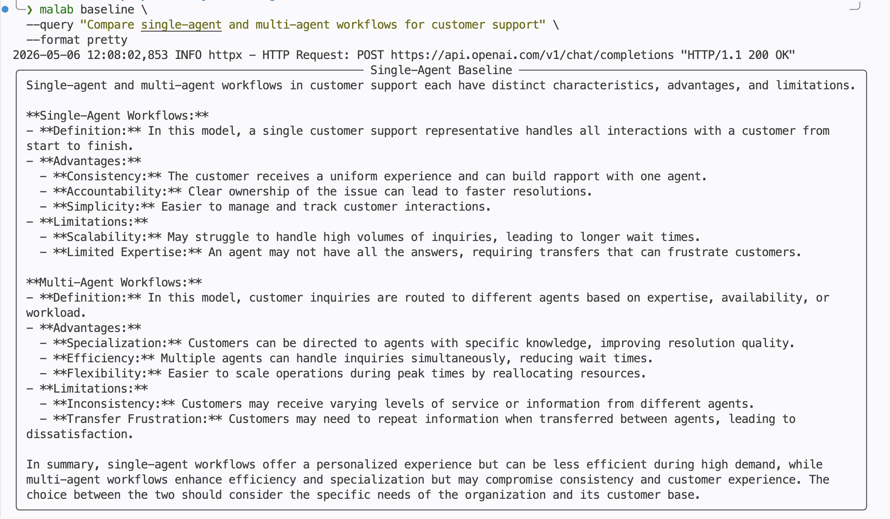
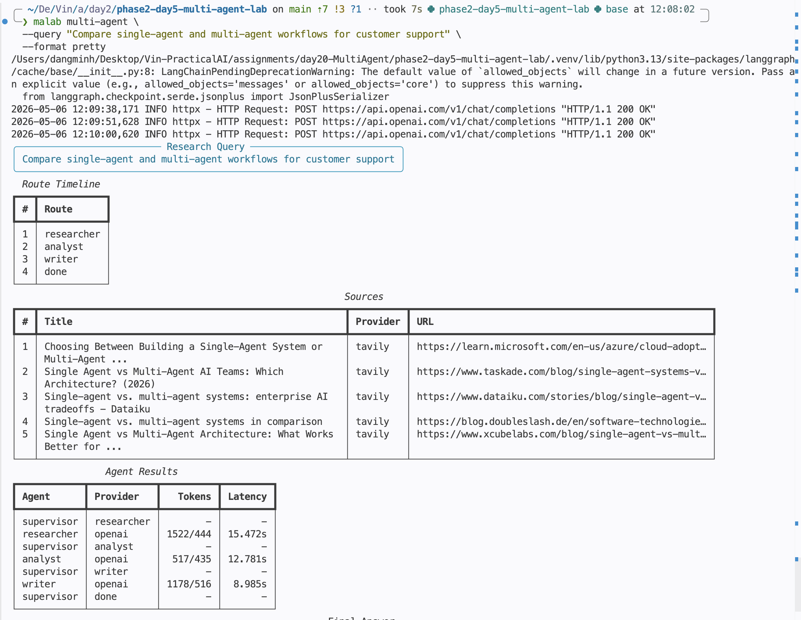
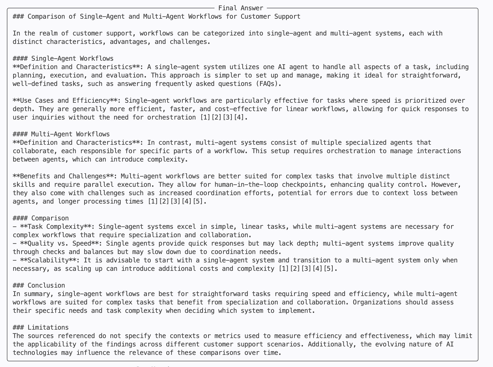
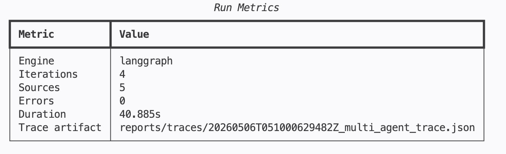
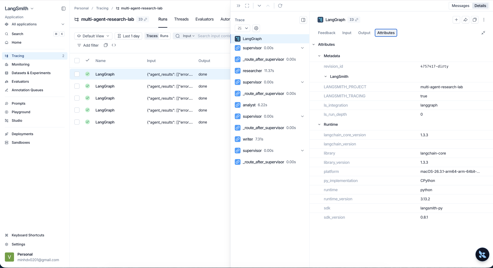

# Lab 20: Multi-Agent Research System

**Học viên: Đặng Văn Minh**

**MSHV: 2A202600027**

This repository is my completed implementation for the **Multi-Agent Systems** lab. It turns the
starter skeleton into a runnable research assistant with:

- a single-agent baseline
- a Supervisor + Researcher + Analyst + Writer workflow
- LangGraph orchestration when installed
- hybrid OpenAI/mock LLM execution
- hybrid Tavily/local search execution
- guardrails, retries, fallback paths, structured state, logs, trace artifacts
- benchmark reporting for baseline vs multi-agent runs
- a Rich CLI demo suitable for screen recording and grading

The project is designed to run both:

- **Online**: OpenAI + Tavily + LangSmith keys configured.
- **Offline**: deterministic mock LLM, local mock search corpus, local JSON traces.

## Grading Map

| Rubric Area | Where To Look | Evidence |
|---|---|---|
| Role clarity | `src/multi_agent_research_lab/agents/` | Supervisor routes, Researcher collects sources, Analyst structures insights, Writer synthesizes final answer. |
| State design | `src/multi_agent_research_lab/core/state.py` | Shared `ResearchState` tracks request, routes, sources, notes, final answer, metrics, errors, trace events. |
| Failure guard | `services/`, `agents/supervisor.py`, `graph/workflow.py` | Max iterations, retries, timeout config, mock fallback, local workflow fallback. |
| Benchmark | `src/multi_agent_research_lab/evaluation/`, `reports/benchmark_report.md` | Baseline vs multi-agent metrics table. |
| Trace explanation | `reports/traces/`, CLI pretty output, LangSmith if configured | Route timeline, agent results, local trace JSON, LangSmith-ready env config. |

## System Overview

```text
User Query
   |
   |-- baseline
   |     `-- Single LLM call
   |
   `-- multi-agent
         |
         `-- Supervisor
               |
               |-- Researcher -> sources + research_notes
               |-- Analyst    -> analysis_notes
               |-- Writer     -> final_answer with source references
               `-- Done
```

The workflow uses a shared Pydantic state object:

```text
ResearchState
├── request
├── next_route
├── route_history
├── sources
├── research_notes
├── analysis_notes
├── final_answer
├── agent_results
├── trace
├── errors
└── metrics
```

## Architecture

```text
src/multi_agent_research_lab/
├── agents/
│   ├── supervisor.py      # routing and max-iteration guard
│   ├── researcher.py      # search + source-grounded research notes
│   ├── analyst.py         # claims, tradeoffs, weak evidence
│   └── writer.py          # final answer and source references
├── core/
│   ├── config.py          # env-based runtime settings
│   ├── schemas.py         # public Pydantic schemas
│   ├── state.py           # shared workflow state
│   └── errors.py
├── graph/
│   └── workflow.py        # LangGraph workflow with local fallback
├── services/
│   ├── llm_client.py      # OpenAI + mock fallback
│   ├── search_client.py   # Tavily + local corpus fallback
│   └── storage.py         # local artifact writer
├── evaluation/
│   ├── benchmark.py       # metrics collection
│   └── report.py          # markdown report rendering
├── observability/
│   ├── logging.py
│   └── tracing.py         # LangSmith env setup + local span helper
└── cli.py                 # Typer + Rich CLI
```

## Setup

Create and activate a virtual environment:

```bash
python -m venv .venv
source .venv/bin/activate
```

Install the project with development and LLM extras:

```bash
pip install -e ".[dev,llm]"
```

Create your local environment file:

```bash
cp .env.example .env
```

Optional online configuration:

```bash
OPENAI_API_KEY=...
OPENAI_MODEL=gpt-4o-mini
TAVILY_API_KEY=...
LANGSMITH_API_KEY=...
LANGSMITH_PROJECT=multi-agent-research-lab
MAX_ITERATIONS=6
TIMEOUT_SECONDS=60
LOG_LEVEL=INFO
```

No key is required for offline demo/testing.

## Verify Installation

Run the test/lint/typecheck suite:

```bash
make test
make lint
make typecheck
```

Expected result:

```text
18 passed
All checks passed!
Success: no issues found
```

Check CLI help:

```bash
malab --help
```

Expected commands:

```text
baseline
multi-agent
benchmark
```

If `malab` is unavailable, use:

```bash
PYTHONPATH=src python -m multi_agent_research_lab.cli --help
```

## Run Baseline

Pretty mode:

```bash
malab baseline \
  --query "Compare single-agent and multi-agent workflows for customer support" \
  --format pretty
```

Expected output:

- a `Single-Agent Baseline` panel
- one direct answer
- if no `OPENAI_API_KEY` is set, the answer clearly uses the deterministic mock fallback

Example screenshot:



JSON mode:

```bash
malab baseline \
  --query "Compare single-agent and multi-agent workflows for customer support" \
  --format json
```

Expected JSON fields:

- `request`
- `final_answer`
- `agent_results`
- `metrics.engine = "single-agent"`

## Run Multi-Agent Demo

Pretty mode:

```bash
malab multi-agent \
  --query "Compare single-agent and multi-agent workflows for customer support" \
  --format pretty
```

Expected output sections:

- `Research Query` panel
- `Route Timeline` table
- `Sources` table
- `Agent Results` table
- `Final Answer` panel
- `Run Metrics` table

Expected route timeline:

```text
researcher -> analyst -> writer -> done
```

Expected metrics:

- `Engine`: `langgraph` if LangGraph is installed and active, otherwise `local-loop`
- `Iterations`: usually `4`
- `Sources`: usually `5`
- `Errors`: `0`
- `Trace artifact`: path under `reports/traces/`

Example screenshots:

Multi-agent progress and route/source visibility:



Final answer:



Run metrics:



JSON mode:

```bash
malab multi-agent \
  --query "Compare single-agent and multi-agent workflows for customer support" \
  --format json
```

Expected JSON fields:

- `route_history`
- `sources`
- `research_notes`
- `analysis_notes`
- `final_answer`
- `agent_results`
- `trace`
- `errors`
- `metrics.trace_path`

## Run Benchmark

Pretty mode:

```bash
malab benchmark --format pretty
```

Expected output:

```text
Benchmark Summary
q1-baseline
q1-multi-agent
q2-baseline
q2-multi-agent
q3-baseline
q3-multi-agent
reports/benchmark_report.md
```

JSON mode:

```bash
malab benchmark --format json
```

Expected JSON fields:

- `report_path`
- `trace_paths`
- `metrics`

The benchmark uses queries from:

```text
configs/lab_default.yaml
```

Generated artifacts:

```text
reports/benchmark_report.md
reports/traces/*_baseline_trace.json
reports/traces/*_multi_agent_trace.json
```

Note: `.gitignore` ignores generated reports and traces. If the grader expects these files committed,
force-add them:

```bash
git add -f reports/benchmark_report.md
git add -f reports/traces/*.json
```

## Expected Benchmark Report

Open:

```bash
cat reports/benchmark_report.md
```

Expected sections:

- `Summary`
- `Metrics`
- `Trace Evidence`
- `Qualitative Notes`
- `Failure Modes And Fixes`
- `Demo Evidence To Attach`

Expected metrics include:

- latency
- estimated cost
- input tokens
- output tokens
- source count
- citation coverage
- failure count
- notes with engine, iterations, and trace path

## Trace And LangSmith

Local trace artifacts are written for both baseline and multi-agent runs:

```text
reports/traces/*_baseline_trace.json
reports/traces/*_multi_agent_trace.json
```

Baseline traces include:

- `baseline_started`
- `baseline_completed`

Multi-agent traces include:

- `workflow_started`
- optional `workflow_engine_fallback`
- `route_decision`
- `agent_completed`
- `workflow_completed`

For LangSmith:

1. Set `LANGSMITH_API_KEY` and `LANGSMITH_PROJECT` in `.env`.
2. Install with `pip install -e ".[dev,llm]"`.
3. Run a multi-agent or benchmark command.
4. Open LangSmith and capture a trace screenshot for the final report.

The code configures LangSmith-compatible environment variables in
`src/multi_agent_research_lab/observability/tracing.py`.

Example LangSmith screenshot:



## Guardrails And Fallbacks

| Guardrail | Implementation |
|---|---|
| Max iterations | `SupervisorAgent` checks `MAX_ITERATIONS`; graph also uses recursion limit. |
| Timeout | Provider clients use `TIMEOUT_SECONDS`. |
| Retry | OpenAI and Tavily calls retry with `tenacity`. |
| LLM fallback | Missing/failing OpenAI -> deterministic mock response. |
| Search fallback | Missing/failing Tavily -> local mock corpus. |
| Workflow fallback | Missing LangGraph package -> bounded local loop. |
| Validation | Pydantic schemas and explicit prompt/query validation. |
| Traceability | State trace events and local JSON artifacts. |

## Important Files For Review

- `docs/design_template.md`: design notes for architecture/rubric review.
- `docs/progress.md`: commit-by-commit implementation log.
- `docs/peer_review_rubric.md`: official review rubric.
- `reports/benchmark_report.md`: generated benchmark comparison.
- `reports/traces/`: local trace artifacts.
- `tests/`: unit and CLI smoke tests.

## Demo Script For Grading

Recommended flow:

```bash
make test
make lint
make typecheck

malab multi-agent \
  --query "Compare single-agent and multi-agent workflows for customer support" \
  --format pretty

malab benchmark --format pretty
```

Then show:

1. Route timeline in CLI.
2. Sources table and final answer.
3. `reports/benchmark_report.md`.
4. `reports/traces/*_baseline_trace.json`.
5. `reports/traces/*_multi_agent_trace.json`.
6. LangSmith screenshot if configured.

## Current Known Behavior

- If API keys are missing, output will mention mock/local fallback metadata.
- If LangGraph is not installed, the workflow uses `local-loop` and records this in trace/metrics.
- This is intentional so tests and demos remain reliable in restricted environments.

## Submission Checklist

- [x] `pytest` passes.
- [x] `ruff check src tests` passes.
- [x] `mypy src` passes.
- [x] `malab multi-agent --format pretty` runs.
- [x] `malab benchmark --format pretty` runs.
- [x] `reports/benchmark_report.md` exists.
- [x] At least one trace artifact exists under `reports/traces/`.
- [x] LangSmith screenshot captured if API key is available.
- [x] Final report/traces are force-added if required by submission rules.
